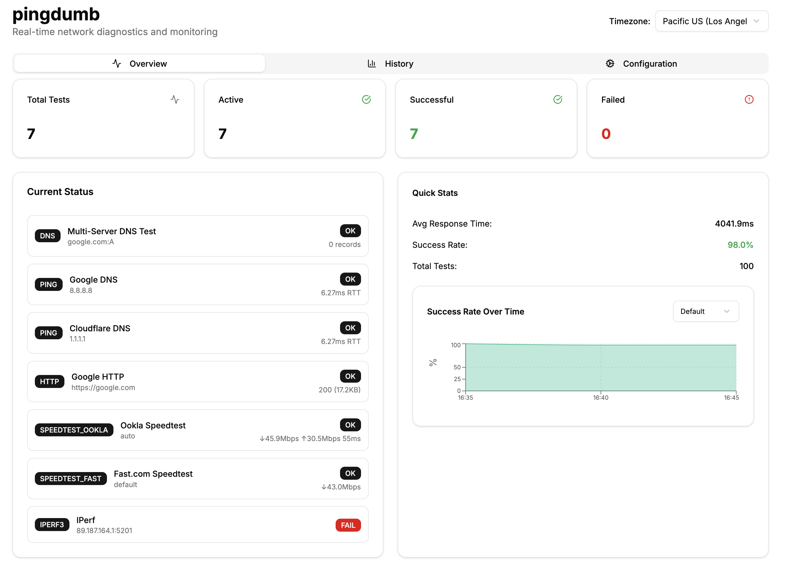
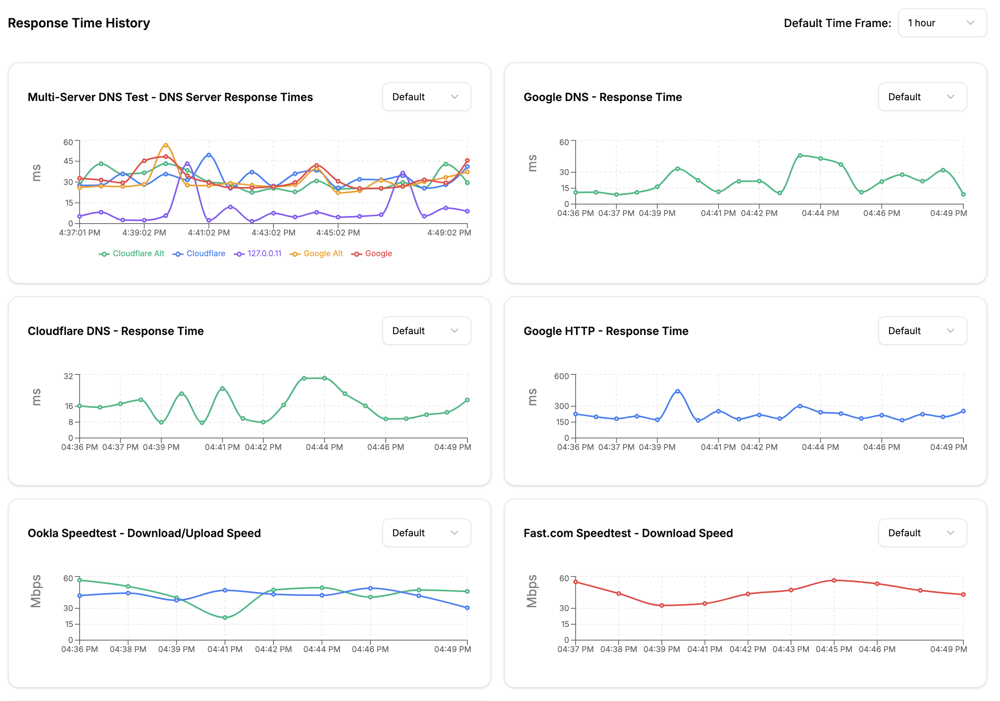

# pingdumb

A comprehensive network monitoring tool with modern web interface for local network diagnostics and performance testing.

## Screenshots

### Dashboard


### Network Tests


## Features

### Network Testing
- **Ping Tests** - RTT monitoring to any host (Google DNS, Cloudflare, local gateway)
- **HTTP/HTTPS Tests** - Website availability and response time monitoring
- **DNS Tests** - Multi-server DNS resolution testing with query time tracking
- **Speed Tests** - Bandwidth testing via Ookla Speedtest and Fast.com
- **iPerf3 Tests** - Bidirectional bandwidth testing (upload/download) to iPerf3 servers

### Monitoring & Analytics
- **Real-time Dashboard** - Live status of all configured tests
- **Historical Graphs** - Time-series data with configurable time ranges (15min to 30 days)
- **Success Rate Tracking** - Visual success/failure rates over time
- **Multi-Server DNS Graphs** - Compare DNS server performance
- **Configurable Intervals** - Test frequency from 1 minute to hours
- **Automatic Scheduling** - Background test execution with asyncio

### User Interface
- **Modern Web Dashboard** - Built with Next.js + TypeScript + shadcn/ui
- **Responsive Design** - Works on desktop and mobile devices
- **Real-time Updates** - WebSocket connections for live data
- **Interactive Graphs** - Recharts-powered visualizations
- **Test Configuration** - Easy setup and management of test parameters
- **Time Range Selection** - Dynamic graph time scaling with proper axis formatting

### Data Management
- **SQLite Database** - Persistent storage of configurations and results
- **JSON API** - RESTful endpoints for all operations
- **Historical Data** - Configurable retention and querying
- **Export Capabilities** - Test results and configuration data

## Quick Start

### Using Docker Compose (Recommended)
```bash
git clone https://github.com/carlfugate/pingdumb.git
cd pingdumb
docker-compose up -d
```

Access the dashboard at http://localhost:3000

### Manual Setup
```bash
# Backend
cd backend
pip install -r requirements.txt
python main.py

# Frontend (separate terminal)
cd frontend
npm install
npm run dev
```

## Architecture

### Technology Stack
- **Frontend**: Next.js 14 + TypeScript + Tailwind CSS + shadcn/ui
- **Backend**: Python FastAPI + asyncio + APScheduler
- **Database**: SQLite with JSON field support
- **Real-time**: WebSockets for live updates
- **Containerization**: Docker + Docker Compose

### Network Tools Integration
- **System Tools**: ping, traceroute, dig, curl, wget
- **Speed Testing**: Ookla Speedtest CLI, Fast.com API integration
- **Bandwidth Testing**: iPerf3 client with bidirectional testing
- **DNS Testing**: Multi-server parallel DNS resolution

## Test Types

### Ping Tests
- RTT measurement to any IPv4/IPv6 host
- Packet loss detection
- Configurable timeout and intervals

### HTTP/HTTPS Tests  
- Website availability monitoring
- Response time measurement
- HTTP status code tracking
- Content size reporting

### DNS Tests
- Multi-server DNS resolution testing
- Query time measurement per server
- Support for custom DNS servers
- A, AAAA, MX, TXT record types

### Speed Tests
- **Ookla Speedtest**: Upload/download speeds + ping + jitter
- **Fast.com**: Netflix CDN download speed testing
- Automatic server selection or manual configuration

### iPerf3 Tests
- Bidirectional bandwidth testing (upload + download)
- Configurable test duration and server endpoints
- Retransmission and network quality metrics
- Support for public iPerf3 servers (iperf.he.net, etc.)

## Configuration

### Test Configuration
- **Name**: Custom test identification
- **Target**: Hostname, IP, or URL to test
- **Interval**: Test frequency (1-1440 minutes)
- **Timeout**: Maximum test duration
- **Enable/Disable**: Toggle test execution

### Default Tests
The system creates these default configurations:
- Google DNS ping (8.8.8.8)
- Cloudflare DNS ping (1.1.1.1)  
- Google HTTP test (https://google.com)
- Local Gateway ping (192.168.1.1)

### Custom Tests
Add your own tests via the web interface:
- **iPerf3**: `iperf.he.net:5201` for bandwidth testing
- **DNS**: Custom DNS servers for resolution testing
- **HTTP**: Internal services and websites
- **Ping**: Network infrastructure monitoring

## API Endpoints

### Configuration Management
- `GET /api/configs` - List all test configurations
- `POST /api/configs` - Create new test configuration  
- `PUT /api/configs/{id}` - Update existing configuration
- `DELETE /api/configs/{id}` - Remove test configuration

### Results & Data
- `GET /api/results` - Fetch test results with filtering
- `GET /api/results?since={timestamp}` - Results since timestamp
- `GET /api/results?limit={n}` - Limit result count
- `WebSocket /ws` - Real-time result streaming

## Development

### Prerequisites
- Docker & Docker Compose (recommended)
- OR: Python 3.11+, Node.js 18+, system network tools

### Local Development
```bash
# Start services
docker-compose up -d

# View logs
docker-compose logs -f backend
docker-compose logs -f frontend

# Rebuild after changes
docker-compose build
```

### Adding New Test Types
1. Add test type to `backend/app/models.py`
2. Implement test logic in `backend/app/network_tests.py`
3. Update frontend display in `frontend/src/components/`
4. Add graph support in test history components

## Troubleshooting

### Common Issues
- **iPerf3 tests failing**: Ensure target server is reachable and supports iPerf3
- **DNS tests not working**: Check DNS server accessibility and firewall rules
- **Speed tests slow**: Network conditions or server selection
- **WebSocket disconnections**: Check network stability and proxy settings

### Logs & Debugging
```bash
# Backend logs
docker-compose logs backend

# Frontend logs  
docker-compose logs frontend

# Database inspection
docker-compose exec backend sqlite3 network_tests.db
```

## License

MIT License - see LICENSE file for details.

## Contributing

1. Fork the repository
2. Create feature branch (`git checkout -b feature/amazing-feature`)
3. Commit changes (`git commit -m 'Add amazing feature'`)
4. Push to branch (`git push origin feature/amazing-feature`)
5. Open Pull Request

## Roadmap

- [ ] IPv6 support for all test types
- [ ] SNMP monitoring integration
- [ ] Email/Slack notifications
- [ ] Multi-location testing
- [ ] Performance baselines and alerting
- [ ] Network topology discovery
